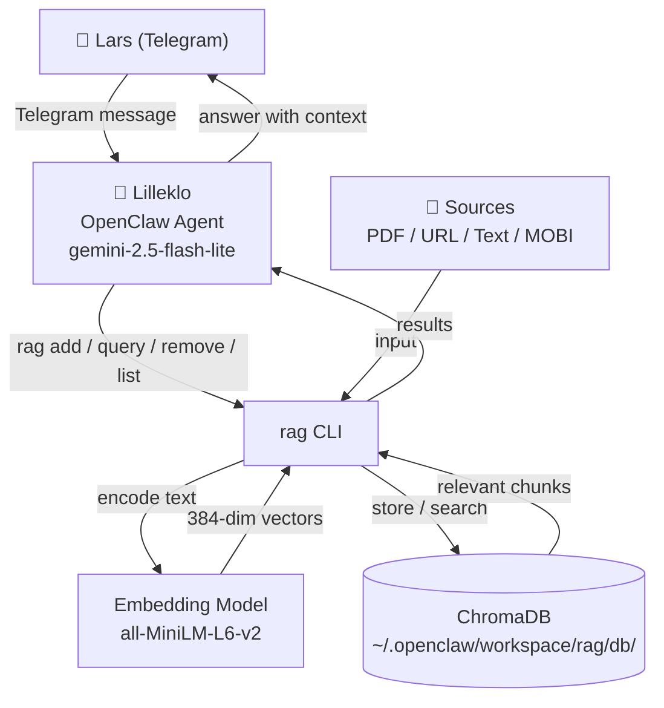
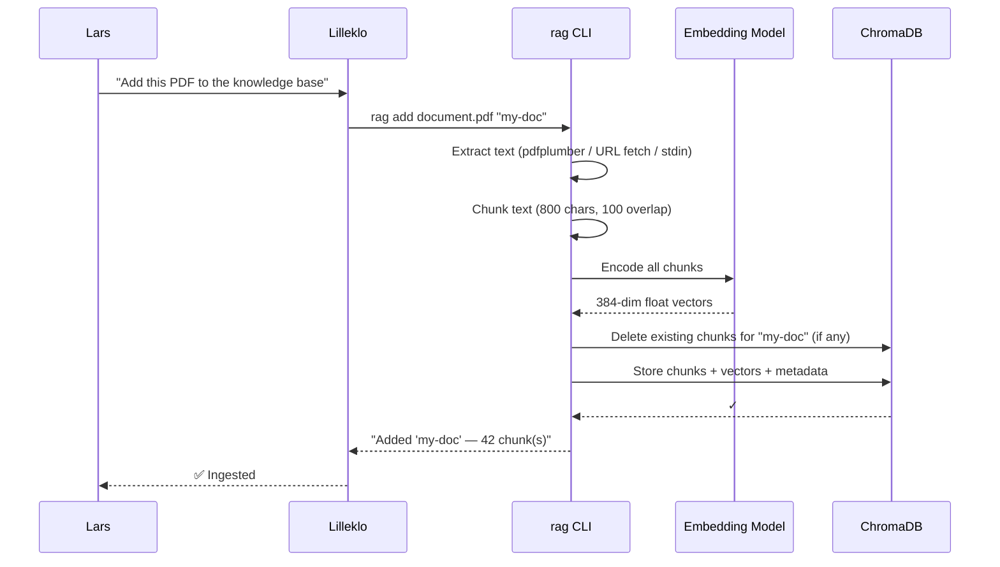
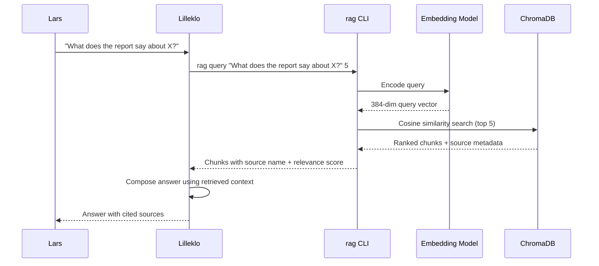
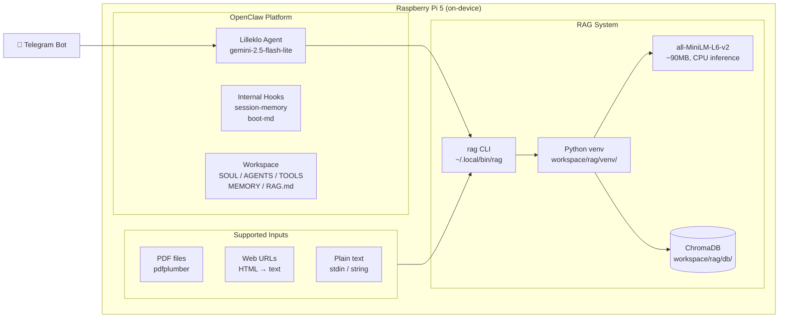
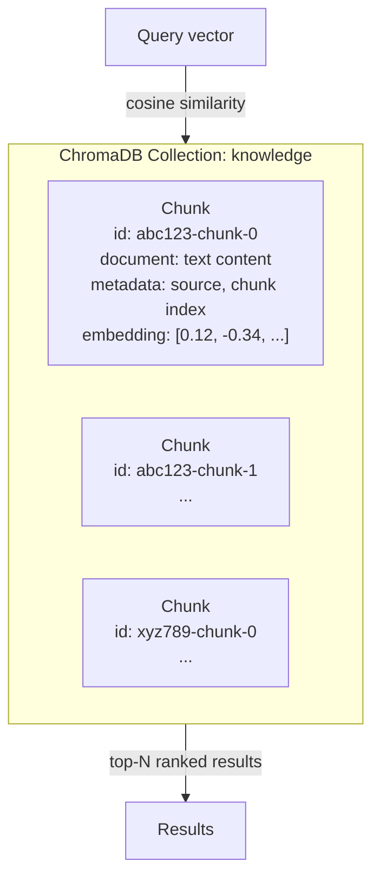
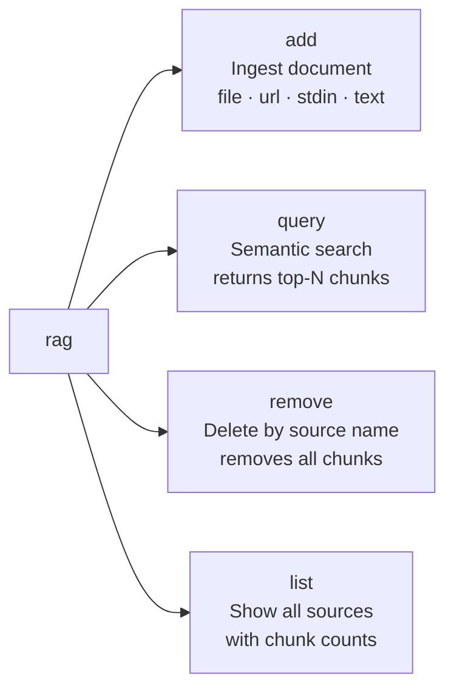

# Architecture

Local, private RAG (Retrieval-Augmented Generation) system running on a Raspberry Pi 5.
All processing happens on-device — no data leaves the machine.

## System Overview

## Ingestion Flow

## Query Flow

## Component Breakdown

## Data Storage

## CLI Commands

## Tech Stack

| Layer | Technology |
|-------|-----------|
| Agent | OpenClaw + gemini-2.5-flash-lite (via OpenRouter) |
| CLI | Python 3.13, single-file script |
| Embeddings | `sentence-transformers` / `all-MiniLM-L6-v2` |
| Vector store | ChromaDB 1.5 (persistent, embedded) |
| PDF extraction | pdfplumber |
| Runtime | Python venv (isolated from system Python) |
| Hardware | Raspberry Pi 5, 8GB RAM, ARM64 |

## Recent changes (last 2 commits)

- **HTML ingestion improvements**: `rag` now includes a robust `HTMLTextExtractor` based on `html.parser` that strips scripts/styles, decodes entities, preserves headings, lists and table structure, and extracts metadata such as `title` and `description` for each source.
- **Text quality pipeline**: added `validate_url()`, `normalize_text()` (whitespace/boilerplate removal, encoding heuristics) and `semantic_chunk_text()` to produce cleaner, semantically-bounded chunks before embedding.
- **Resilience & observability**: basic `logging` configuration and placeholders for retry logic (`tenacity`) were added to improve fetch reliability and debugging.
- **Table & caption handling**: table rows and figure captions are converted into readable text so tabular content is preserved in chunks.
- These updates improve HTML/source ingestion quality and retrieval relevance; embedding model (`all-MiniLM-L6-v2`) and ChromaDB usage remain unchanged.

## Diagrams — quick explanations

- **System Overview**: shows the end-to-end interaction: the user sends a message to the Lilleklo agent, the agent calls the `rag` CLI to add/query sources, `rag` encodes text via the embedding model and stores/searches vectors in ChromaDB, and Lilleklo composes answers using retrieved chunks.
- **Ingestion Flow**: step-by-step of `rag add`: extract text (PDF/URL/stdin), normalize and semantically chunk the text, encode chunks to embeddings, and persist chunks + metadata to ChromaDB. Recent changes mainly affect the extraction and chunking steps.
- **Query Flow**: a query is encoded to a vector, used to run a cosine-similarity search in ChromaDB, top-N chunks are returned with source metadata and relevance scores, and Lilleklo composes an answer citing sources.
- **Component Breakdown**: maps physical/runtime pieces on the Pi (OpenClaw agent, Python venv, embedding model, ChromaDB) and supported input types (PDF, URL, text). It clarifies which components run on-device.
- **Data Storage**: describes the ChromaDB collection and what each stored chunk contains (id, source name, chunk index, embedding vector and metadata) — used for fast similarity search and provenance.
- **CLI Commands**: `rag add` (ingest), `rag query` (semantic search), `rag remove` (delete by source name), `rag list` (show sources and chunk counts). Each command maps to the flows shown above.
