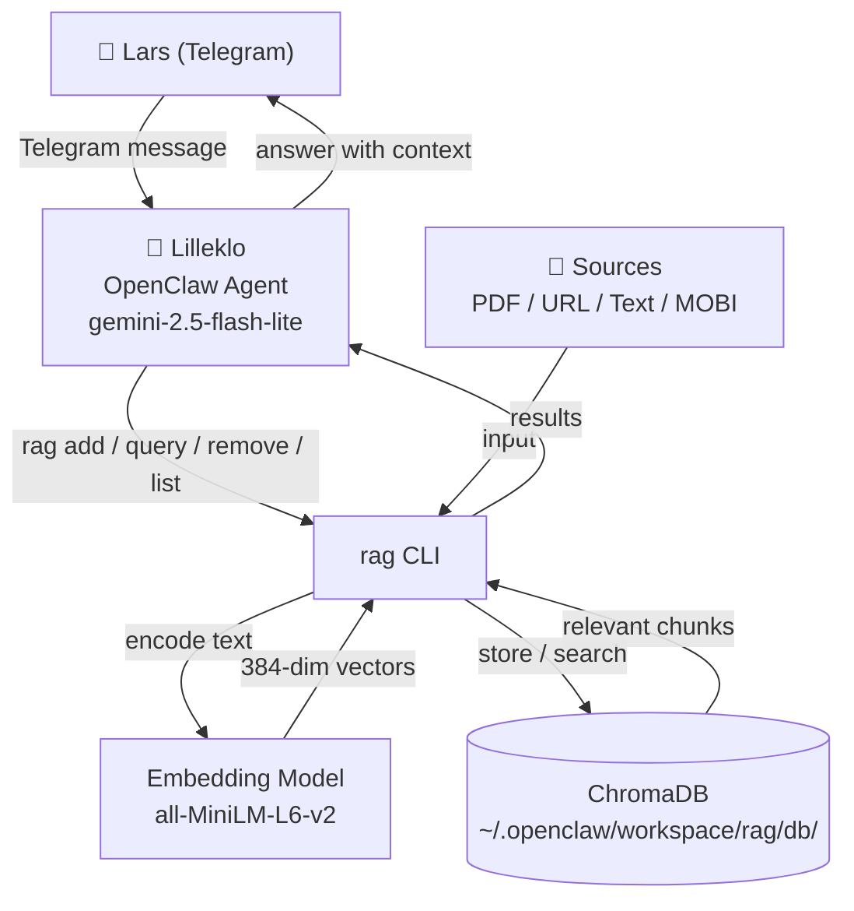
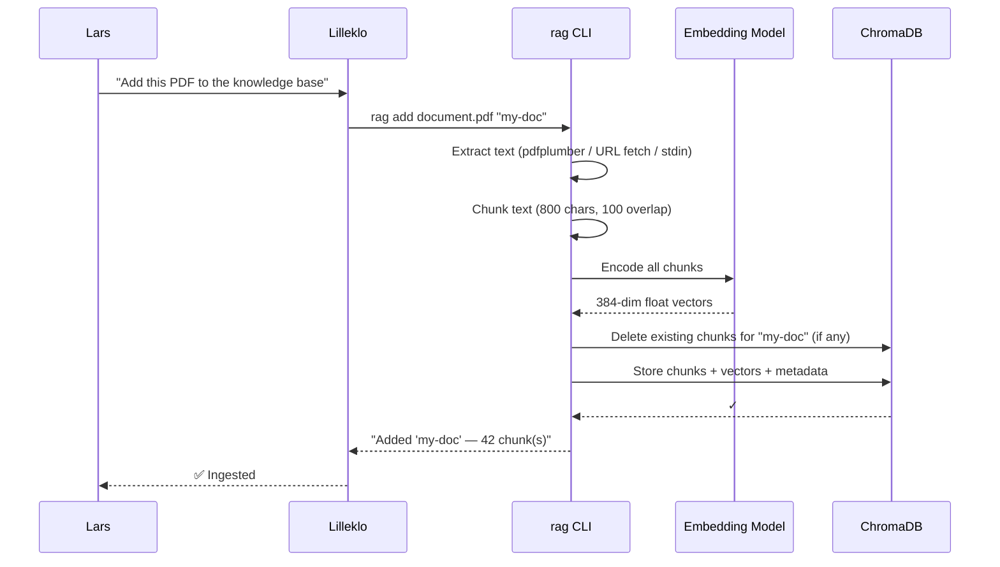
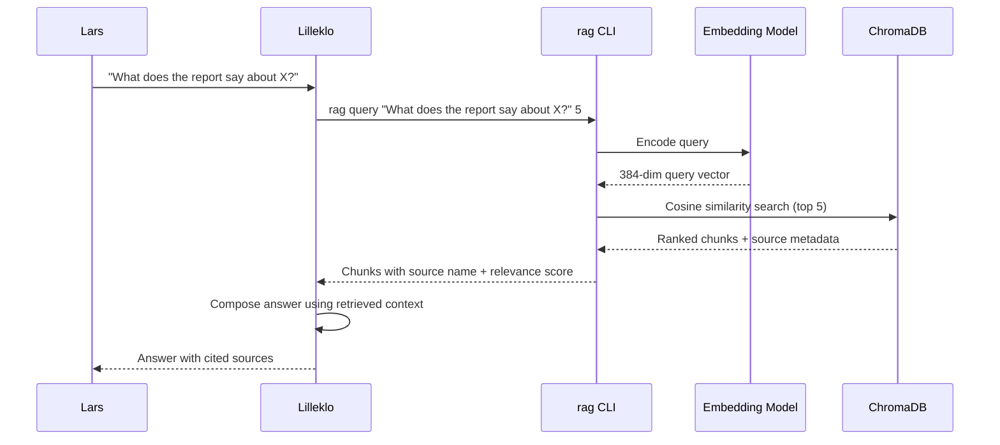
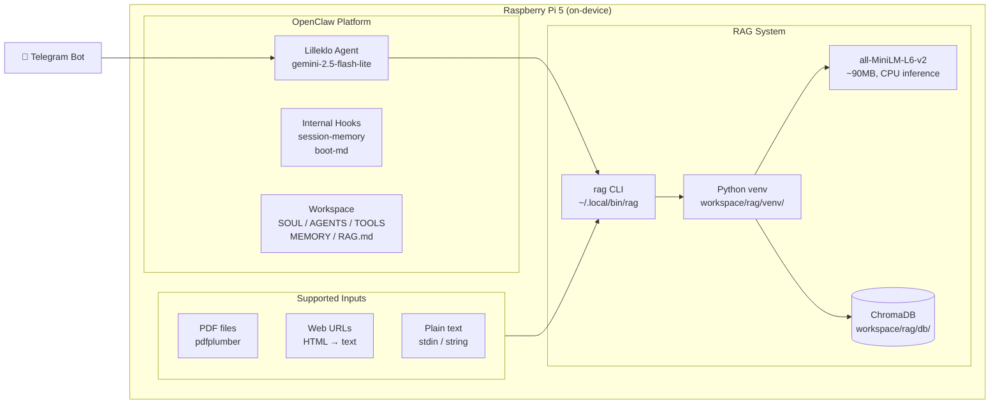
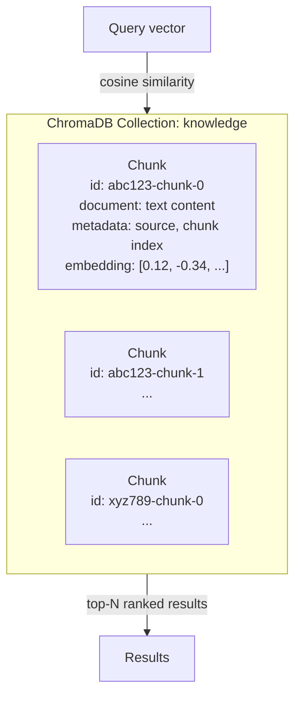
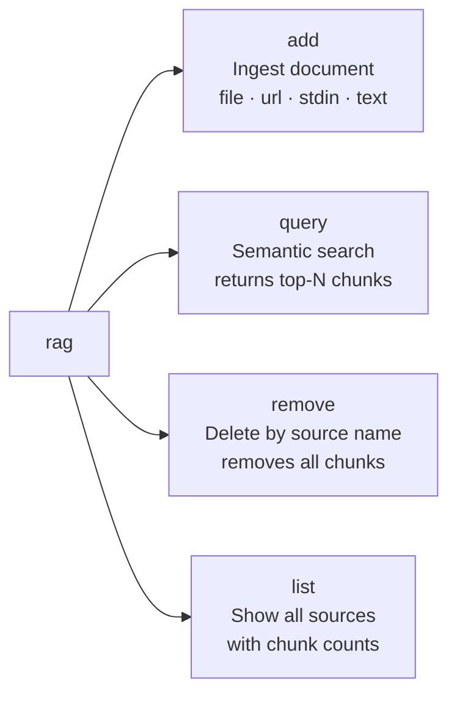

# Architecture

Local, private RAG (Retrieval-Augmented Generation) system running on a Raspberry Pi 5.
All processing happens on-device — no data leaves the machine.

## System Overview

## Ingestion Flow

## Query Flow

## Component Breakdown

## Data Storage

## CLI Commands

## Tech Stack

| Layer | Technology |
|-------|-----------|
| Agent | OpenClaw + gemini-2.5-flash-lite (via OpenRouter) |
| CLI | Python 3.13, single-file script |
| Embeddings | `sentence-transformers` / `all-MiniLM-L6-v2` |
| Vector store | ChromaDB 1.5 (persistent, embedded) |
| PDF extraction | pdfplumber |
| Runtime | Python venv (isolated from system Python) |
| Hardware | Raspberry Pi 5, 8GB RAM, ARM64 |
